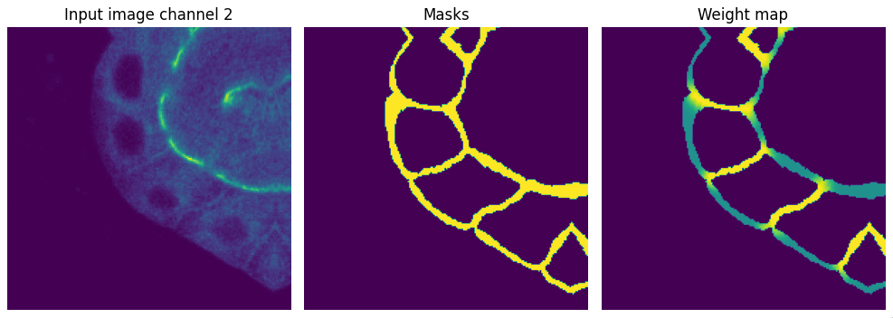
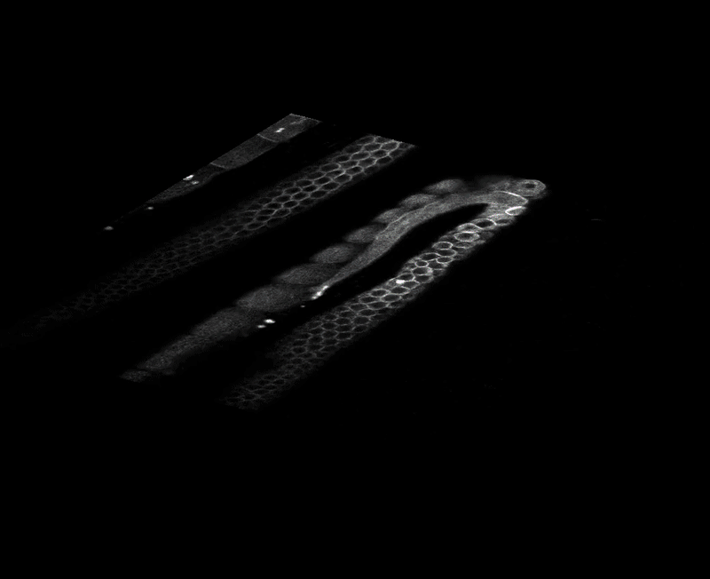

# *C. elegans* germline instance segmentation


This repo contains the data processing, network and instance segmentation code required to segment cells in the *C. elegans* germline.

Above is an example segmentation using the trained UNet model provided in this repo. Issues with over-segmentation, particularly in the region between the large and small cells, is currently being improved. 

The segmentation above involves the following steps:
1. Predict cell edges using a 3D UNet
   1. 3D image data was patched
   2. Precompute weight maps in 3D, as defined in 2D for the original UNet paper to act as a pixel-wise loss
      1. This focuses the network to learn the borders between tight clusters of cells
   3. Convert ground truth masks to binary cell boundaries
   4. Augment data at train time with elastic deformation, Gaussian blur, flips and random Gaussian noise. 
      1. Augmentations used here are from [albumentations_3d](https://github.com/callum-jpg/albumentations_3d)
   5. Train with weighted Binary Cross Entropy + Dice loss
2. Threshold and perform a distance 3D watershed on the resulting UNet edge prediction
   1. This results in an over-segmented image
3. Perform graph-based partitioning on the watershed super-pixels
   1. This will group similar super pixels together, creating cell instance segmentations


# How to run

The fastest and easist way to use this model is to download and run the docker container. This will serve a Gradio GUI in your web browser that you can submit inference jobs with. To do so, run the following commands in your terminal:
```
docker pull ctromanscoia/unet3d_c_elegans:latest
docker run -it --rm -p 127.0.0.1:8000:8000 ctromanscoia/unet3d_c_elegans:latest
```
Then, navigate to [http://localhost:8000/](http://localhost:8000/) to adjust parameters and submit images for inference. 


Alternatively, check out `notebooks/example_usage.ipynb` on how to run training and inference.


# Training strategy

The images to be segmented are 2-channel 3D arrays with a typical shape of (25, 1024, 1024). The z-depth varies from image to image.


Let's start by creating a patched data set for the images. This will also create a weight map using `unet.utils.data_utils.calculate_binary_weight_map`, which calculates distance transforms to each instance mask individually. Because this is computationally intensive, weight maps are precomputed at patch generation only.

```python
source_data = pd.read_csv("./data/data_stacked_channels_training.csv")
utils.create_patch_dataset(source_data_csv, patch_size=(24, 200, 200), create_wmap=True)

# Create patches adds a channel dimention if not present (C, spatial)
train_dataset = pd.read_csv("training_data.csv")

dataset = CElegansDataset(data_csv=train_dataset, targets=[["image"], ["mask"], ["weight_map"]])

patch_num = 12
patch_image = dataset[patch_num]["image"]
patch_mask = dataset[patch_num]["mask"]
patch_weight_map = dataset[patch_num]["weight_map"]

fig, ax = plt.subplots(1, 3, figsize=(10, 5))

for _ax in ax:
    _ax.axis("off") 

z = 15
ax[0].imshow(patch_image[0,z,...])
ax[1].imshow(skimage.measure.label(patch_mask[0,z,...])) # Relabel to show better distinct between instance masks
ax[2].imshow(patch_weight_map[0,z,...])
ax[0].set_title("Input image channel 1")
ax[1].set_title("Masks")
ax[2].set_title("Weight map")
fig.tight_layout()
```


Now, let's convert the instance masks to binary edges as the semantic target for the UNet to predict. Let's also mask the weight map to only include pixels that are edges. This weight map will be used for pixel wise loss to focus model training on learning these hard to segment areas. We can also invert the weight map with `aug.EdgeMaskWmap(invert_wmap=True)`.
```python
transforms = [
    aug.LabelsToEdges(connectivity=2, mode="thick"),
    aug.EdgeMaskWmap(edge_multiplier=1, wmap_multiplier=1, invert_wmap=False),
    aug.ToTensor()
]

dataset = CElegansDataset(data_csv=train_dataset, transforms=transforms, targets=[["image"], ["mask"], ["weight_map"]])

patch_num = 12
patch_image = dataset[patch_num]["image"]
patch_mask = dataset[patch_num]["mask"]
patch_weight_map = dataset[patch_num]["weight_map"]

fig, ax = plt.subplots(1, 3, figsize=(10, 5))

for _ax in ax:
    _ax.axis("off") 

z = 15
ax[0].imshow(patch_image[1,z,...])
ax[1].imshow(patch_mask[0,z,...])
ax[2].imshow(patch_weight_map[0,z,...])
ax[0].set_title("Input image channel 2")
ax[1].set_title("Masks")
ax[2].set_title("Weight map")
fig.tight_layout()
```


Since the dataset is very small, let's add some augmentations such as elastic deform
```python
transforms = [
    aug.LabelsToEdges(connectivity=2, mode="thick"),
    aug.EdgeMaskWmap(edge_multiplier=1, wmap_multiplier=1, invert_wmap=False),
    aug.ElasticDeform(sigma=10, p=1, channel_axis=0, mode="mirror"),
    aug.ToTensor()
]

dataset = CElegansDataset(data_csv=train_dataset, transforms=transforms, targets=[["image"], ["mask"], ["weight_map"]])

# Let's use the dataloader to apply augmentations to batches
data_loader = DataLoader(
    dataset,
    shuffle=True
)
data = next(iter(data_loader))
patch_image = data["image"][0]
patch_mask = data["mask"][0]
patch_weight_map = data["weight_map"][0]

fig, ax = plt.subplots(1, 3, figsize=(10, 5))
for _ax in ax:
    _ax.axis("off") 

z = 15
ax[0].imshow(patch_image[1,z,...])
ax[1].imshow(patch_mask[0,z,...])
ax[2].imshow(patch_weight_map[0,z,...])
ax[0].set_title("Input image channel 2")
ax[1].set_title("Masks")
ax[2].set_title("Weight map")
fig.tight_layout()
```



We can also add blurring and rotation.


## Run training
```python
data_loader = {"train": train_loader, "val": val_loader}
model = UNet3D(
    in_channels=2, out_channels=1, f_maps=32
)
model = utils.load_weights(
    model, 
    weights_path="./data/pretrained_model/best_checkpoint.pytorch", 
    device="cpu", # Load to CPU and convert to GPU later
    dict_key="state_dict"
)
params_to_update = utils.find_parameter_requires_grad(model)
model.to(device)
loss_function = WeightedBCEDiceLoss()
optimizer = torch.optim.Adam(params_to_update, lr=1e-2, weight_decay=1e-5)
scheduler = torch.optim.lr_scheduler.ReduceLROnPlateau(
    optimizer, mode="min", factor=0.2, patience=20
)
# Instantiate the trainer class
trainer = RunTraining(
    model,
    device,
    data_loader,
    loss_function,
    optimizer,
    scheduler,
    num_epochs=100,
)
# Run training/validation
trainer.fit()
```

## Run inference
```python
load_data_inference = pd.read_csv("data/data_test_stacked_channels.csv")
model = UNet3D(
    in_channels=2, out_channels=1, f_maps=32
)
model = utils.load_weights(
    model, 
    # Make sure to change weights path if retrained
    weights_path="./data/pretrained_model/best_checkpoint.pytorch", 
    device="cpu", # Load to CPU and convert to device later
    dict_key="state_dict"
)
model.to(device)
# Instantiate the inferer class
infer = Inferer(
    model=model, 
    patch_size=(24, 200, 200),
    )
# Run inference on csv images
infer.predict_from_csv(load_data_inference)
```

For full example usage, see the [example notebook](./notebooks/example_usage.ipynb)


### Segmentation examples
 





## Performance


## Current limitations

Visual inspection reveals that the prediction of the smaller cells is good, but the edge prediction for the larger cells is more unstable. Some images possess a great signal to background ratio at the edges of large cells, which improves edge prediction, whereas other images have a poor edge signal in these areas.

This can be viewed as a training data imbalance problem, as there is an abundance of small cells with distinct membrane signal, but for the larger cells the strong edge signal is only present on edges between cells and not on the edge of the large cell proximal to the background. 

Future work will aim to increase the sample of the larger cells in an attempt to better generalise the UNet model in edge prediction. With better edge prediction comes better instance segmentation.


